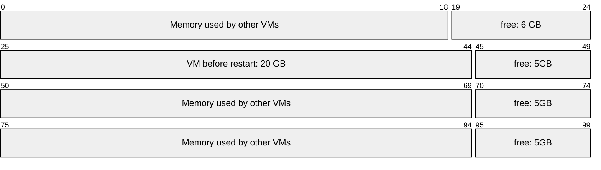
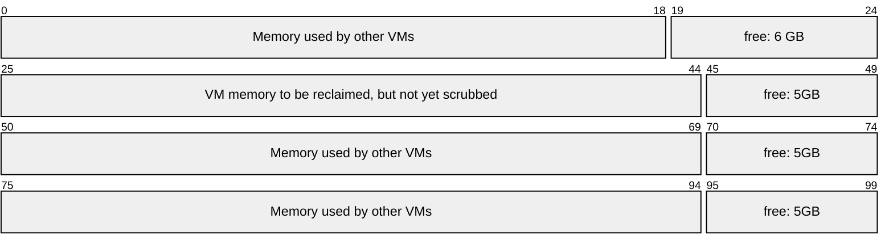
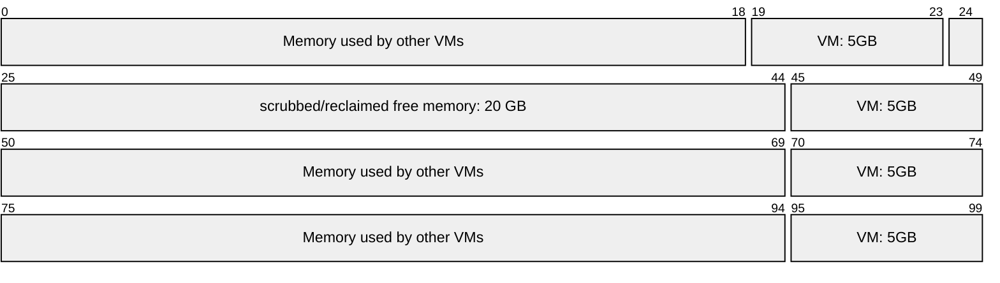

## Xen host memory scrubbing

Xen does not immediately reclaim deallocated memory.
Instead, Xen has a host memory scrubber that runs lazily in
the background to reclaim recently deallocated memory.

Thus, there is no guarantee that Xen has finished scrubbing
when `xenopsd` is being asked to build a domain.

## Waiting for enough free host memory

> [!info] 
> In case the reclaimed host-wide memory is not sufficient yet,
> when `xenopsd` starts to build a VM, its
> [build_pre](https://github.com/xapi-project/xen-api/blob/073373ff/ocaml/xenopsd/xc/domain.ml#L899-L964)
> (also part of VM restore / VM migration)
> [polls](https://github.com/xapi-project/xen-api/blob/073373ff2abfa386025f2b1eee7131520df76be9/ocaml/xenopsd/xc/domain.ml#L904)
> Xen [until enough host-wide memory](https://github.com/xapi-project/xen-api/blob/073373ff2abfa386025f2b1eee7131520df76be9/ocaml/xenopsd/xc/domain.ml#L236-L272)
> has been reclaimed. See the
> [walk-through of Domain.build](../../../xenopsd/walkthroughs/VM.build/Domain.build.md#build_pre-prepare-building-the-vm)
> of `xenopsd` for more context:

```ml
let build_pre ~xc ~xs ~vcpus ~memory ~has_hard_affinity domid =
  let open Memory in
  let uuid = get_uuid ~xc domid in
  debug "VM = %s; domid = %d; waiting for %Ld MiB of free host memory"
    (Uuidx.to_string uuid) domid memory.required_host_free_mib ;
  (* CA-39743: Wait, if necessary, for the Xen scrubber to catch up. *)
  if
    not (wait_xen_free_mem ~xc (Memory.kib_of_mib memory.required_host_free_mib))
  then (
    error "VM = %s; domid = %d; Failed waiting for Xen to free %Ld MiB"
      (Uuidx.to_string uuid) domid memory.required_host_free_mib ;
    raise (Not_enough_memory (Memory.bytes_of_mib memory.required_host_free_mib))
  ) ;
```

This is the implementation of the polling function:

```ml
let wait_xen_free_mem ~xc ?(maximum_wait_time_seconds = 64) required_memory_kib
    : bool =
  let open Memory in
  let rec wait accumulated_wait_time_seconds =
    let host_info = Xenctrl.physinfo xc in
    let free_memory_kib =
      kib_of_pages (Int64.of_nativeint host_info.Xenctrl.free_pages)
    in
    let scrub_memory_kib =
      kib_of_pages (Int64.of_nativeint host_info.Xenctrl.scrub_pages)
    in
    (* At exponentially increasing intervals, write  *)
    (* a debug message saying how long we've waited: *)
    if is_power_of_2 accumulated_wait_time_seconds then
      debug
        "Waited %i second(s) for memory to become available: %Ld KiB free, %Ld \
         KiB scrub, %Ld KiB required"
        accumulated_wait_time_seconds free_memory_kib scrub_memory_kib
        required_memory_kib ;
    if
      free_memory_kib >= required_memory_kib
      (* We already have enough memory. *)
    then
      true
    else if scrub_memory_kib = 0L (* We'll never have enough memory. *) then
      false
    else if
      accumulated_wait_time_seconds >= maximum_wait_time_seconds
      (* We've waited long enough. *)
    then
      false
    else (
      Thread.delay 1.0 ;
      wait (accumulated_wait_time_seconds + 1)
    )
  in
  wait 0
```

## Waiting for enough free memory on NUMA nodes

To address the same situation not host-wide but specific to NUMA
nodes, the build, restore and migrate processors of domains on NUMA machines needs a similar algorithm.

This should be done directly before the NUMA placement algorithm
runs, or even as part of an improvement for it:

The NUMA placement algorithm calls the `numainfo` hypercall to
obtain a table of NUMA nodes with the available memory on each
node and the distance matrix between the NUMA nodes as the basis
for the NUMA placement decision for the VM.

If the reported free memory of the host is lower than would be
expected at that moment, this might be an indication that some
memory might not be scrubbed yet. Another indication might be
if the amount of free memory is increasing between two checks.

Also, if other domains are in the process of being shut down,
or if a shutdown recently occurred, Xen is likely scrubbing in
the background.

For cases where the NUMA placement returns no NUMA node affinity
for the new domain, the smallest possible change would be to
simply re-run the NUMA placement algorithm.

As a trivial first step would be to retry once if the initial
NUMA placement of a VM failed and abort retrying if the available
memory did not change since the initial failed attempt.


System-wide polling seems to abort polling when the amount of
free memory did not change compared to the previous poll. For
the NUMA memory poll, the previous results could be kept likewise
and compared to the new results.

Besides, the same polling timeout like for system-wide memory
could be used.

## An example scenario

This is an example scenario where not waiting for memory scrubbing
in a NUMA-aware way could fragment the VM across many NUMA nodes:

In this example, a relatively large VM is rebooted:

Fictional machine with 4 NUMA nodes, 25 GB each (for layout reasons):



VM is destroyed:



NUMA placement runs, and sees that no NUMA node has enough memory
for the VM. Therefore:
1. NUMA placement does not return a NUMA placement solution.
2. As a result, vCPU soft pinning it not set up
3. As a result, the domain does not get a NUMA node affinity
4. When `xenguest` allocates the VM's memory, Xen falls back to
   round-robin memory allocation across all NUMA nodes.

Even if Xen has already scrubbed the memory by the time the
NUMA placement function returns, the decision to not select
a NUMA placement has already been done. Then, the domain is
built in this way:


