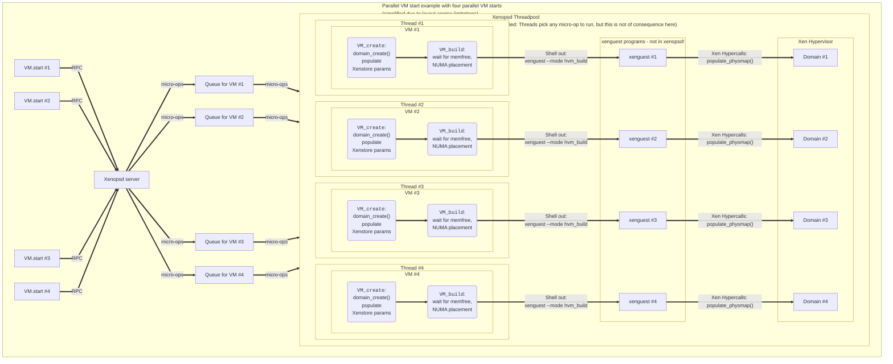

```mermaid
%%{
  init: {
    "fontSize": "22",
    "flowchart": {
      "wrap": true,
      "curve": "linear"
    },
    "sequence": {
      "mirrorActors": true
    }
  }
}%%
graph TD
subgraph parallel_vm_start[
  Parallel VM start example with four parallel VM starts
  #40;simplified due to layout engine limitations#41;
]
  VM1.start[VM.start #1] ==>|RPC| Xenops_server 
  VM2.start[VM.start #2] ==>|RPC| Xenops_server
  VM3.start[VM.start #3] ==>|RPC| Xenops_server
  VM4.start[VM.start #4] ==>|RPC| Xenops_server

  Xenops_server[Xenopsd server] ==>|micro-ops| Q1[Queue for VM #1]
  Xenops_server[Xenopsd server] ==>|micro-ops| Q2[Queue for VM #2]
  Xenops_server[Xenopsd server] ==>|micro-ops| Q3[Queue for VM #3]
  Xenops_server[Xenopsd server] ==>|micro-ops| Q4[Queue for VM #4]

  Q1 ==>|micro-ops| threadpool
  Q2 ==>|micro-ops| threadpool
  Q3 ==>|micro-ops| threadpool
  Q4 ==>|micro-ops| threadpool
end
%% End of subgraph parallel_vm_start

subgraph threadpool[
  Xenopsd&nbsp;Threadpool
  #40;Simplified:&nbsp;Threads&nbsp;pick&nbsp;any&nbsp;micro#8209;op&nbsp;to&nbsp;run,&nbsp;but&nbsp;this&nbsp;is&nbsp;not&nbsp;of&nbsp;consequence&nbsp;here#41;
]
  subgraph Thread1[Thread #1]
    subgraph VM1[ VM #1 ]
      create1(<tt>VM_create</tt>:
              domain_create#40;#41;
              populate
              Xenstore params) ==> build1(<tt>VM_build</tt>:
                                          wait for memfree,
                                          NUMA placement)
    end
  end
  subgraph Thread2[Thread #2]
    subgraph VM2[ VM #2 ]
      create2(<tt>VM_create</tt>:
              domain_create#40;#41;
              populate
              Xenstore params) ==> build2(<tt>VM_build</tt>:
                                          wait for memfree,
                                          NUMA placement)
    end
  end
  subgraph Thread4[Thread #4]
    subgraph VM4[ VM #4 ]
      create4(<tt>VM_create</tt>:
              domain_create#40;#41;
              populate
              Xenstore params) ==> build4(<tt>VM_build</tt>:
                                          wait for memfree,
                                          NUMA placement)
    end

  end
  subgraph Thread3[Thread #3]
    subgraph VM3[ VM #3 ]
      create3(<tt>VM_create</tt>:
              domain_create#40;#41;
              populate
              Xenstore params) ==> build3(<tt>VM_build</tt>:
                                          wait for memfree,
                                          NUMA placement)
    end
  end
  %% Layout limitation workaround: While the threadpool would end here,
  %% mermaid is not able to keep the layour aligned if we end it here.

  subgraph xenguest_procs[xenguest programs - not in xenopsd!]
    build1 ==>|Shell out:<br>xenguest --mode hvm_build|x1[xenguest #1]
    build2 ==>|Shell out:<br>xenguest --mode hvm_build|x2[xenguest #2]
    build3 ==>|Shell out:<br>xenguest --mode hvm_build|x3[xenguest #3]
    build4 ==>|Shell out:<br>xenguest --mode hvm_build|x4[xenguest #4]
  end

  subgraph Xen Hypervisor
    x1 ==>|Xen Hypercalls: populate_physmap#40;#41;| d1[Domain #1]
    x2 ==>|Xen Hypercalls: populate_physmap#40;#41;| d2[Domain #2]
    x3 ==>|Xen Hypercalls: populate_physmap#40;#41;| d3[Domain #3]
    x4 ==>|Xen Hypercalls: populate_physmap#40;#41;| d4[Domain #4]
  end
end
%% end of the threadpool subgraph; moved here to keep the layout aligned
```
